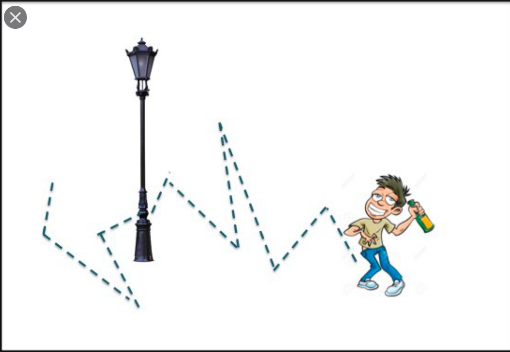

```{r, echo = FALSE, warning = FALSE, message = FALSE}
library(ggplot2)
library(ProbBayes)
library(dplyr)
library(tidyverse)
crcblue <- "#2905a1"
```

## A Random Walk

```{r,  echo = FALSE, out.width = 350}

```

## A Random Walk

- A person takes a random walk on a number line on the values 1, 2, 3, 4, 5, 6. 

- If the person is currently at an interior value (2, 3, 4, or 5), in the next
second she is equally likely to remain at that number or move to an adjacent
number. 

- If she does move, she is equally likely to move left or right. 

- If the
person is currently at one of the end values, in the next second she is
equally likely to stay still or move to the adjacent location.

## Discrete Markov Chain

- Describes
probabilistic movement between a number of states. 

- Six possible states, 1 through 6, corresponding to the possible locations of the
walker. 

- The probability that she moves to another
location depends only on her current location and not on previous locations visited. 

## Transition Probability Matrix

- Movement between states is described in terms of transition probability matrix $P$.

- Give the probabilities  of moving between all possible states
in a single step.

$$
P = \begin{bmatrix} 
.50 &.50& 0& 0& 0& 0 \\
.25 &.50& .25& 0& 0& 0\\
0 &.25& .50& .25& 0& 0\\
0 &0& .25& .50& .25& 0\\
0 &0& 0& .25& .50& .25\\
0 &0& 0& 0& .50& .50\\
\end{bmatrix}
$$

## Properties of Markov Chains

- It is possible to go from every state to every state in one or more steps --
a Markov chain with this property is said to be **irreducible**.

- Given that the
person is in a particular state, if the person can only return to this state at
regular intervals, then the Markov chain is said to be **periodic**. 

- This example is aperiodic since the walker cannot return to the current state at regular intervals.

## Some Results

- Represent one's current location as a probability row vector of the
form
\begin{equation*}
p = (p_1, p_2, p_3, p_4, p_5, p_6),
\end{equation*}
where $p_i$ represents the probability that the person is currently in state $i$. 

- If
$p^{(j)}$ represents the location of the traveler at step $j$, then the location of the
traveler at the $j + 1$ step is given by the matrix product
\begin{equation*}
p^{(j+1)} = p^{(j)} P.
\end{equation*}

- If $p^{(j)}$ represents the location at step $j$, then the location of the traveler after $m$ additional steps, $p^{(j+m)}$, is given by the matrix product
\begin{equation*}
p^{(j+m)} = p^{(j)} P^m,
\end{equation*}
where $P^m$ indicates the matrix multiplication $P \times P \times ... \times P$.

## Illustrate on R

- Suppose that the person begins at state 3 that is represented in R by the vector ```p``` with a 1 in the third entry:

```{r}
p <- c(0, 0, 1, 0, 0, 0)
```

- Define the transition matrix by use of the ```matrix()```\index{matrix()} function.

```{r}
P <- matrix(c(.5, .5, 0, 0, 0, 0,
              .25, .5, .25, 0, 0, 0,
              0, .25, .5, .25, 0, 0,
              0, 0, .25, .5, .25, 0,
              0, 0, 0, .25, .5, .25,
              0, 0, 0, 0, .5, .5),
              nrow=6, ncol=6, byrow=TRUE)
```

## Probabilities After Steps

- If one multiplies this vector by the matrix ```P, one obtains the probabilities of being in all six states after one move.

```{r}
print(p %*% P, digits = 5)
```

- If one multiplies ```p``` by the matrix ```P``` four times, one obtains the probabilities of being in the different states after four moves.

```{r}
print(p %*% P %*% P %*% P %*% P, digits = 5)
```

## Limiting Behavior

- For an irreducible, aperiodic Markov chain, there is a limiting behavior of the matrix power $P^m$ as $m$ approaches infinity.  

- This limit is equal to
\begin{equation}
W = \lim_{m \rightarrow \infty} P^m,
\end{equation}
where $W$ has common rows equal to $w$.  

- As one takes an infinite number of moves, the probability of landing at a particular state does not depend on the initial starting state.

## Demonstrate this Empirically

- Using a loop, we take the transition matrix $P$ to the 100th power by repeatedly multiplying the transition matrix by itself. 

- The rows of the matrix ```Pm``` appear to be approaching a constant vector.  Specifically, it appears the constant vector $w$ is equal to (0.1, 0.2, 0.2, 0.2, 0.2, 0.1).

```{r}
Pm <- diag(rep(1, 6))
for(j in 1:100){
  Pm <- Pm %*% P
}
print(Pm, digits = 5)
```

## Stationary Distribution 

- One can derive a rule for determining this constant vector.

- If we can find a probability vector $w$ such that $wP = w$. This vector $w$ is
said to be the **stationary distribution**\. 

- If a Markov chain is irreducible and
aperiodic, then it has a unique stationary distribution. 

- Moreover the limiting
distribution of this Markov chain, as the number of steps approaches infinity,
will be equal to this stationary distribution.

## Simulating a Markov chain

- We can demonstrate the existence of the stationary distribution
of our Markov chain by running a simulation experiment. 

- Start our
random walk at a particular state, say location 3, and then simulate many
steps of the Markov chain using the transition matrix $P$. 

- The relative frequencies
of our traveler in the six locations after many steps will eventually
approach the stationary distribution $w$.

## Using R

- The transition matrix ```P``` has been defined.

- Set up a storage vector ```s``` for the locations of our traveler in the random
walk.  

- Indicate that the starting location for our traveler is state 3 and perform
a loop to simulate 10,000 draws from the Markov chain. 

```{r}
s <- vector("numeric", 10000)
s[1] <- 3
for (j in 2:10000)
s[j] <- sample(1:6, size=1, prob=P[s[j - 1], ])
```

## Relative Frequencies

- Record the relative frequencies of each of the outcomes 1, 2, ..., 6 after each iteration of the simulation.  

- Figure graphs the relative frequencies of each of the outcomes as a function of the iteration number.


```{r,  echo = FALSE, out.width = 200}
knitr::include_graphics("figures/markovchainrun.png")
```

## Comments

- We see from the  that the relative frequencies of the states are converging
to the stationary distribution $w = (0.1, 0.2, 0.2, 0.2, 0.2, 0.1).$  

- One 
confirms that this specific vector $w$ is indeed the stationary distribution  by multiplying
$w$ by the transition matrix $P$ and noticing that the product is equal to $w$.

```{r}
w <- matrix(c(.1,.2,.2,.2,.2,.1), nrow=1, ncol=6)
 w %*% P
```
